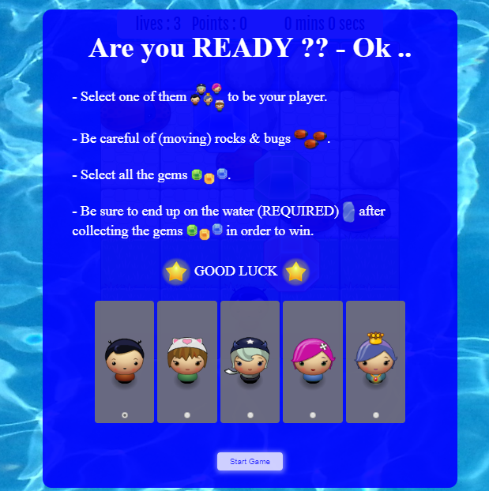
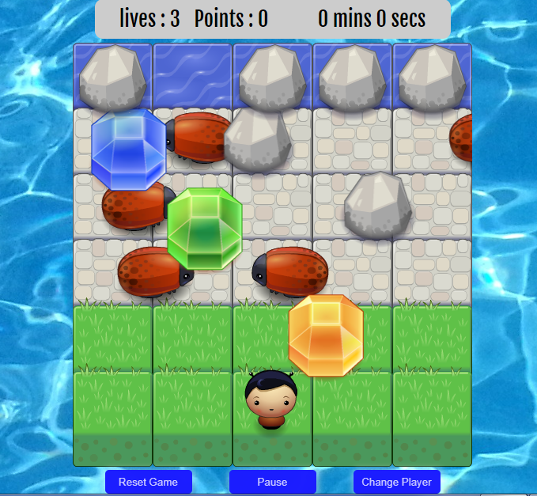
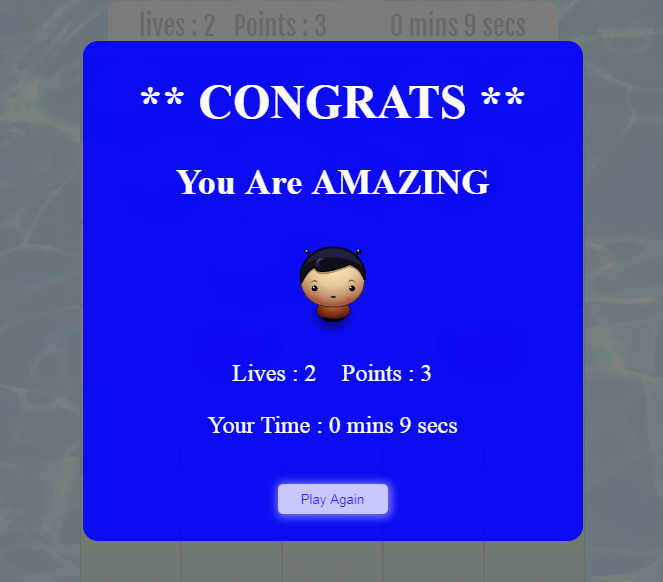
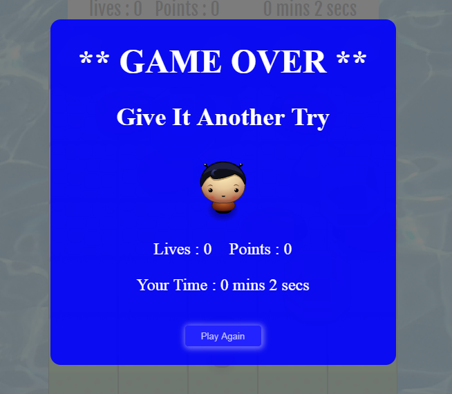

# Classic Arcade Game Clone
## Overview:
> `full responsive with all devices with screen width that are equal to or more than 360px`
A Spirited game depends primarily on the making decision speed in order to avoid bugs and reach safely to the water sit

## How to start:
   - This game is hosted on github pages and do not need any previous installations.
   - To run the game directly, please click [here]().
   - For developers: the game repository is [here]().
   - This game consists of index.html, style.css, app.js, engine.js, and resources.js
   - all the functionality comes from the .js files, where:
     - app.js: where all the game objects and the relation among them are located.
     - engine.js: where the game loop which is required for repeated execution is located
     - resources.js: which is used to cache all the used image for more performance improvment
         
##### the "main modal"
 
 
##### the "game board"
 

##### the "win modal"
 
 
##### the "lose modal"
 
 
## Game Rule:
>The gameplay rule is very simple: collect your gems, save your lives, and reach the water area with as many lives as possible from the total lives of three

## Instructions :
   - Select one of them    to be your player.
  - Be careful of  moving rocks & bugs .
  - Select all the gems .
  - Be sure to end up on the water (REQUIRED)   after collecting the gems  in order to win.
  
## The Challenge:
> The challenge is to end up on the water with 3 lives 

## Additional Features
   - Player selection: you can (as a user)  select the image for the player character before starting the game.
   - Score: in the score panel above the game board, you can watching the (lives) counter, and the (points) counter.
   - Collectible gems: you'll see the gems on the board which you must collect them in order to win.
   - Fixed rocks: which will add additional challenge in order to reach the required area to win.
   - Moving rocks: which will add additional challenge, because you shoul avoid them to not lose your lives.
   - Timed games.
   - Bugs that Moves in the opposite direction relative to the default given one:
     which also will add additional challenge to the game.
   - Win modal: will open up in case of win.
   - Lose modal: will open in case of lose.
   - Full responsive: all devices with screen width that are equal to or more than 360px can run this game perfectly.    
   - Under the game board you'll see :
     - the (Reset Game) Button: which can reset the position of gems, bugs, and player, in addition to reset the 
      lives and points counters
     - the (Pause/Play) Button: which can pause the game whenever you want and back to play again whenever you want either
     - the (Change Player) Button: which will open the (main modal) and then you can choose the player you want

## Support
> If you like this repo and find it useful, please consider (★) starring it, so that it can reach a broader audience.
